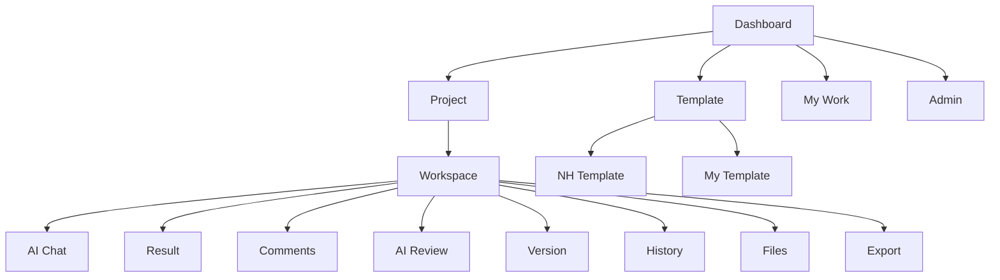

# IA & 화면 명세 v1.0

> **관련 문서**: [기능명세 인덱스](개발문서/기능명세/00_INDEX.md) | [PRD](개발문서/01_PRD.md)
>
> 기능별 동작 상세는 [기능명세](개발문서/기능명세/00_INDEX.md)로 분리했다. 본 문서는 IA · 화면 · 상태 모델의 정본이다.

## 1. IA

## 2. 핵심 화면
### S01 Dashboard
최근 프로젝트, 나의 작업, 검토 대기, 최근 Version, 최근 활동을 보여준다.

### S02 Project List
프로젝트명, 상태, 소유자, 마지막 활동, 멤버 수, 미처리 검토 건수를 표시한다.

### S03 Project Workspace
좌측: 파일/Template/멤버
중앙: 생성 결과물
우측: AI Chat/협업/AI 의견
상단: Version/History/Export

### S04 AI Chat
입력 영역 + 참고자료 선택 + Template 선택 + 작업 유형 선택.

### S05 Result/Review
결과물 미리보기, 댓글, AI 의견 요약, 반영 선택을 한 화면에서 연결한다.

### S06 Version
Version 목록, 현재 버전, 비교 대상 선택, 변경 요약, 관련 의견을 제공한다.

### S07 History
시간순 Timeline 형태로 사용자 작업, AI 작업, 댓글, 반영 결정, Version 생성 이력을 제공한다.

## 3. 상태 모델
### AI Job
REQUESTED → PROCESSING → COMPLETED / FAILED / CANCELLED

### Comment/Review
OPEN → REVIEWED → ACCEPTED / REJECTED / DEFERRED

### Project
DRAFT → ACTIVE → REVIEW → COMPLETED → ARCHIVED

## 4. 핵심 UX 원칙
- AI 제안과 사람의 최종 결정을 시각적으로 구분한다.
- Version과 History를 같은 화면에서 연결한다.
- 사용자가 “왜 바뀌었는지”를 두 번 이상 클릭하지 않고 확인할 수 있게 한다.
- 프로젝트의 현재 상태와 다음 액션을 항상 보여준다.
- 파일/의견/Version을 프로젝트 단위로 묶어 검색 가능하게 한다.
